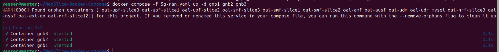
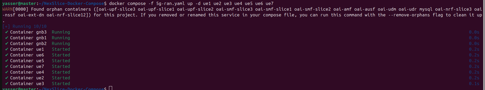

# NexSlice on Docker Compose: Towards an Open and Reproducible Network Slicing Testbed for 5G and Beyond

## Overview

This repository provides a deployment of OAI 5G Core with network slicing, using three simulated gNBs (UERANSIM) and multiple simulated UEs, each assigned to a specific S-NSSAI (Single Network Slice Selection Assistance Information). The network slicing is applied at the core level, ensuring that different UEs are routed through their respective slices.

A Network Slice consists of 5G Core and 5G RAN components, all defined within a PLMN. A slice is identified using S-NSSAI, which consists of:

- Slice/Service Type (SST): Defines the expected slice behavior (e.g., eMBB, URLLC, mMTC, V2X).

- Slice Differentiator (SD): Optionally differentiates slices within the same SST.

Each UE can connect to up to eight (8) slices simultaneously. SST values range from 0 to 255, with: SST 1 = eMBB, SST 2 = URLLC, SST 3 = mMTC, SST 4 = V2X, SST 5-127: Reserved for experimental use and SST 128-255: Reserved for operators


To keep the figure clear and uncluttered, we did not include links between functions.

### **Network Slicing Configuration**

The slicing structure follows the setup illustrated in the figure above.

- **Slice 1 (Blue) [SST=128, SD=128]**:
  - **Core Components**: NRF12, SMF1, UPF1
  - **UEs**: UE1 (via gNB1), UE4 (via gNB2), UE6 (via gNB3)
- **Slice 2 (Red) [SST=1, SD=1]**:
  - **Core Components**: NRF12, SMF2, UPF2
  - **UEs**: UE2 (via gNB1), UE7 (via gNB3)
- **Slice 3 (Yellow) [SST=130, SD=130]**:
  - **Core Components**: NRF3, SMF3, UPF3
  - **UEs**: UE3 (via gNB1), UE5 (via gNB2)

The common **AMF, NSSF, UDM, UDR, AUSF** components serve all slices. SMF and UPF in **Slice 1 and Slice 2** share the same NRF, making both UPFs discoverable by both SMFs.

Note that SSTs are only for numerical reference and does not reflect standard SST behaviour e.g. eMBB, URLCC, mMTC, V2X etc.

## Prerequisites

You can install Docker following the steps given in: https://docs.docker.com/engine/install/ubuntu/

You can avoid typing sudo each time by adding your user to the Docker group : 
```bash
sudo usermod -aG docker $USER 
newgrp docker
```
Verify the installation:

```bash
docker ps
```


## Deployment

### **Clone the Repository**

```bash
git clone https://github.com/AIDY-F2N/OAI_CORE_SLICING.git
cd OAI_CORE_SLICING
```

### **Deploy the 5G Core**

```bash
docker compose -f docker-compose-slicing-core.yaml up -d
```


#### **Verify Core Deployment**

```bash
docker compose -f docker-compose-slicing-core.yaml ps -a
```
All containers should be in the **Up (healthy)** state.


### **Deploy the 3 gNBs**

```bash
docker compose -f docker-compose-slicing-ran.yaml up -d gnb1 gnb2 gnb3
```


### **Deploy All UEs**

```bash
docker compose -f docker-compose-slicing-ran.yaml up -d ue1 ue2 ue3 ue4 ue5 ue6 ue7
```


Ensure all functions are in the Up state:

```bash
docker ps
```


## **Validation & Testing**

### **Check Logs for gNBs and UEs**

```bash
docker logs [container_name]
```


### **Check the Traceroute to Verify UE Connectivity to the Appropriate UPF**

```bash
docker exec oai-ext-dn traceroute [ip@_UE]
```

### **Ping Google from UE**

```bash
docker exec [container_name] ping -c 4 8.8.8.8
```


For simplicity, only one UE is tested here, but you can verify all UEs to ensure they are assigned to the correct slices.

## **Cleanup**

To **undeploy** the network functions, use the following commands:

### **Undeploy gNBs & UEs**

```bash
docker compose -f docker-compose-slicing-ran.yaml down -t 0
```

### **Undeploy 5G Core**

```bash
docker compose -f docker-compose-slicing-core.yaml down -t 0
```


## **Contact**
- Yasser BRAHMI, abdenour-yasser.brahmi@telecom-sudparis.eu
- Massinissa AIT ABA, massinissa.ait-aba@davidson.fr
