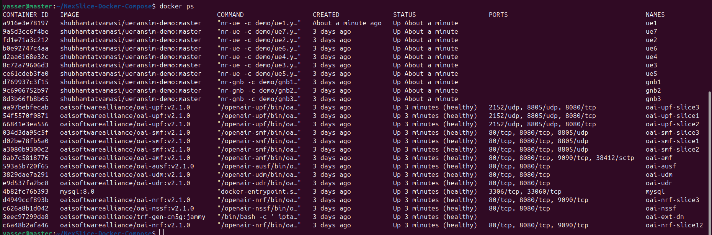
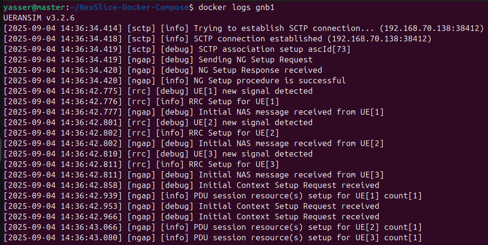
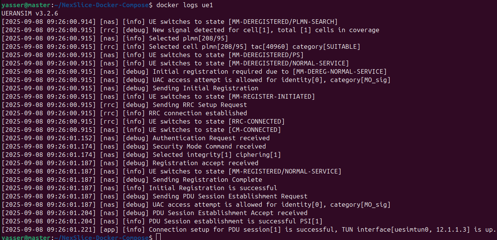

# NexSlice on Docker Compose: Towards an Open and Reproducible Network Slicing Testbed for 5G and Beyond


## Introduction to 5G and Network Slicing

As network demands increase, 5G and upcoming 6G technologies aim to deliver flexible, scalable connectivity for applications like autonomous vehicles, industrial automation, and immersive AR/VR. These use cases require strict QoS guarantees, met through native service differentiation mechanisms such as enhanced Mobile Broadband (eMBB), Ultra-Reliable Low-Latency Communication (URLLC), and massive Machine-Type Communications (mMTC). Network slicing has emerged as a key architectural feature, allowing multiple isolated virtual networks to coexist over shared infrastructure, each tailored to specific performance needs using VNFs like AMF, SMF, and UPF.

A **slice** can be tailored to specific requirements (e.g., high throughput, low latency). Each slice is identified by **S-NSSAI (Single Network Slice Selection Assistance Information)**, which contains:

- **SST (Slice/Service Type):** Defines the expected slice behavior  
  - 1 → eMBB  
  - 2 → URLLC  
  - 3 → mMTC  
  - 4 → V2X  
  - 5–127 → Experimental use  
  - 128–255 → Operator-specific use  
- **SD (Slice Differentiator):** Optionally differentiates slices with the same SST.

## Network Slicing in NexSlice

The slicing configuration follows the diagram below:

<p align="center">
  
</p>


 Slice   | Color | SST | SD | UE IP Subnet  | Core Components   | UEs (gNB)                          |
 |-------|-------|-----|----|---------------|-------------------|------------------------------------|
 | 1     | Blue  | 1   | 1  | 12.1.1.0/24   | NRF12, SMF1, UPF1 | UE1 (gNB1), UE4 (gNB2), UE6 (gNB3) |
 | 2     | Red   | 2   | 1  | 12.1.2.0/24   | NRF12, SMF2, UPF2 | UE2 (gNB1), UE7 (gNB3)             |
 | 3     | Yellow| 3   | 1  | 12.1.3.0/24   | NRF3, SMF3, UPF3  | UE3 (gNB1), UE5 (gNB2)             |


Shared components across slices: **AMF, NSSF, UDM, UDR, AUSF**.  
SMFs and UPFs in Slice 1 and Slice 2 share the same NRF, making UPFs discoverable by both SMFs.
Note that SSTs are only for numerical reference and does not reflect standard SST behaviour e.g. eMBB, URLCC, mMTC, V2X etc.


## Docker vs Docker Compose vs Kubernetes

 | Tool              | Description                                                                                                                                    |
 |-------------------|------------------------------------------------------------------------------------------------------------------------------------------------|
 | **Docker**        | Runs individual containers.                                                                                                                    |
 | **Docker Compose**| Defines and runs **multi-container applications** using a YAML file. Ideal for setting up our **5G testbed**.                                  |
 | **Kubernetes**    | Production-grade orchestration platform for managing containers across multiple nodes, providing **scalability, resilience, and auto-healing**.|

In this repo, we use **Docker Compose** for simplicity, NexSlice is also available on Kubernetes: https://github.com/AIDY-F2N/NexSlice


## Prerequisites

You can install Docker following the steps given in: https://docs.docker.com/engine/install/ubuntu/

1- You can avoid typing sudo each time by adding your user to the Docker group : 
```bash
sudo usermod -aG docker $USER 
newgrp docker
```
2- Verify the installation:

```bash
docker ps
```


**Clone this Repository**

```bash
git clone https://github.com/AIDY-F2N/NexSlice-Docker-Compose.git
cd NexSlice-Docker-Compose
```

## Deploy the 5G Core
We deploy the OAI 5G SA Core v2.1.0 as a set of cloud-native, containerized network functions (NFs) running in individual docker containers. The deployment follows the 3GPP Release 16 architecture, comprising AMF, SMF, AUSF, NRF, NSSF, UDM, and UDR for the control plane, and UPF for the user plane.

The connection sequence begins with the AMF, which manages UE registration and mobility. It interacts with the AUSF for authentication, using subscription data provided by the UDM/UDR, backed by a MySQL database. All NFs register and discover each other via the NRF. Once authentication is successful, the SMF handles session creation and control, while the UPF forwards traffic between the RAN and external data networks.

Core network slicing is enabled by instantiating multiple SMF, UPF, and optionally NRF components. Each slice is associated with a unique S-NSSAI, composed of an SST and an SD. During PDU session setup, the NSSF selects the appropriate slice and routes the session to the corresponding SMF and UPF. Common control-plane functions such as AMF, UDM, AUSF, and NSSF are shared across slices to optimize resource usage, while SMF/UPF pairs are isolated per slice to ensure traffic separation. 


1- Deploy 5g core functions
```bash
docker compose -f 5g-core.yaml up -d
```


2- Verify core deployment

```bash
docker compose -f 5g-core.yaml ps -a
```


All containers should be in the **Up (healthy)** state.


## Deploy gNBs and UEs
UERANSIM (User Equipment and RAN Simulator) is an open-source 5G simulator that emulates both the gNB and UE functionalities. It enables testing mobility, session setup, slicing behavior, and QoS in a lightweight environment.
It is fully compatible with OAI 5GC and is widely used to test:

In this repo, three gNBs and multiple UEs are simulated, each assigned to specific slices.

1- Deploy All gNBs
```bash
docker compose -f 5g-ran.yaml up -d gnb1 gnb2 gnb3
```


2- Deploy All UEs

```bash
docker compose -f 5g-ran.yaml up -d ue1 ue2 ue3 ue4 ue5 ue6 ue7
```


3- Ensure all functions are in the Up state:

```bash
docker ps
```


All containers should be in the **Up** state.


## Validation & Testing

1- Check AMF logs
```bash
docker logs oai-amf
```


2- Check Logs for gNBs and UEs

```bash
docker logs [container_name]
```



3- Ping Google from UE

```bash
docker exec [container_name] ping -c 4 8.8.8.8
```


For simplicity, only one UE is tested here, but you can verify all UEs.

**SST-Based Slicing**

UEs connect to different slices based on their selected SSTs, each receiving an IP from a distinct subnet linked to a specific DNN. note that SSTs are only for numerical reference and does not reflect standard SST behaviour e.g. eMBB, URLCC, mMTC, V2X etc.
We can verify that by doing traceroute command that show by where the traffic pass, UPF1 with UE using slice 1, UPF2 with UE using slice 2 and  UPF3 with UE using slice 3.

```bash
docker exec oai-ext-dn traceroute [ip@_UE]
```


## Monitoring: Prometheus, Grafana, and cAdvisor

- **cAdvisor:** Collects real-time container-level metrics (CPU, memory, I/O).  
- **Prometheus:** Time-series database that scrapes metrics from cAdvisor and stores them.  
- **Grafana:** Visualization layer, connected to Prometheus, to create dashboards and plots.  

Together, they provide **end-to-end observability** of the 5G slices and UE traffic.

1- Deploy 
```bash
docker compose -f monitoring.yaml up -d
```


2- Check if are Up
```bash
docker ps | grep -E "cadvisor|prometheus|grafana"
```

All containers should be in the **Up (healthy)** state.

3- Access Grafana: http://localhost:3000
(default login: admin/admin).


4- Go to data source, Set Prometheus : http://prometheus:9090


5- Go to Dashboards, create a new Dashboard


6- Import grafana-dashboard.json and choose prometheus as the data source:


7- You will have the plots of all your cointainers to monitor them : 


## Advanced Tests

- **Ping:** Simple ICMP tool to verify connectivity and round-trip latency from UEs to external hosts (e.g., Google 8.8.8.8).  
- **iperf3:** Performance testing tool for measuring TCP/UDP throughput between UEs and the Data Network.  

These tools validate that UEs are correctly attached and traffic is routed through the appropriate UPFs.

1- Use the provided script to send ping requests from each UE:
```bash
chmod +x tests/ping.sh 
./tests/ping.sh
```
All UEs will attempt to ping a target (e.g., google.com) from their respective virtual interfaces. 


2- Deploy iperf3 server using the following command :
```bash
docker compose -f iperf3.yaml up -d
```


iperf3 pod acts as server which is listening to 100 ports from 5201 to 5301. By default, the iPerf3 server will listen to all active interfaces of the host for new connections.

3- We need to install iperf3 on all UEs:
```bash
chmod +x tests/install-iperf3.sh 
./tests/install-iperf3.sh
```

4- Run the following script, UEs will act as clients to connect to the iperf3 server during 60 seconds. 
```bash
chmod +x tests/iperf3.sh 
./tests/iperf3.sh
```


5- Traffic generated via iPerf3 triggers CPU and Memory usage over multiple containers.


## Cleanup

To **undeploy** the network functions, use the following commands:

```bash
docker compose -f 5g-ran.yaml down -t 0
docker compose -f monitoring.yaml down -t 0
docker compose -f iperf3.yaml down -t 0
docker compose -f 5g-core.yaml down -t 0
```


## Contact
- Yasser BRAHMI, abdenour-yasser.brahmi@telecom-sudparis.eu
