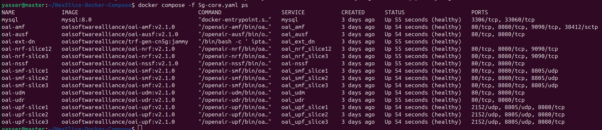

# NexSlice on Docker Compose: Towards an Open and Reproducible Network Slicing Testbed for 5G and Beyond

## Citation
This work has been accepted as a demo paper at The 27th International Conference on Modeling, Analysis and Simulation of Wireless and Mobile Systems (MSWiM 2025), Barcelona, Spain, October 27th – 31st, 2025

If you use NexSlice in your research or experiments, please cite our paper once it is published in IEEE (The official DOI and link will be added here upon publication).

## Introduction to 5G and Network Slicing

As network demands grow, 5G and future 6G technologies aim to deliver **flexible and scalable connectivity** for critical applications such as autonomous vehicles, industrial automation, remote healthcare, and immersive AR/VR.  
These use cases require strict **Quality of Service (QoS)** guarantees, which are achieved through native 5G service differentiation mechanisms:

- **eMBB (Enhanced Mobile Broadband):** High throughput for video streaming and AR/VR.  
- **URLLC (Ultra-Reliable Low-Latency Communications):** Low latency and reliability for autonomous driving, industrial robots.  
- **mMTC (massive Machine-Type Communications):** Support for IoT sensors and devices at large scale.  
- **V2X (Vehicle-to-Everything):** Communication between vehicles, infrastructure, pedestrians, and networks.

To address these needs, **network slicing** has emerged as a key architectural feature. It enables the creation of multiple **isolated virtual networks** on the same physical infrastructure, each optimized for different requirements.  
This is achieved by combining **Virtualized Network Functions (VNFs)** such as:  

- **AMF (Access and Mobility Management Function)** – mobility & registration  
- **SMF (Session Management Function)** – session establishment and routing  
- **UPF (User Plane Function)** – data forwarding in the user plane  


### Network Slice Identification

Each slice is identified by a **Single Network Slice Selection Assistance Information (S-NSSAI)**, 32 bits, composed of:

- **SST (Slice/Service Type, 8 bits):** Defines the intended service.  
  - `1` → eMBB  
  - `2` → URLLC  
  - `3` → mMTC  
  - `4` → V2X (Vehicle-to-Everything)  
  - `5–127` → Experimental use  
  - `128–255` → Operator-specific use  

- **SD (Slice Differentiator, 24 bits):** Differentiates slices with the same SST.  
  Useful when multiple slices of the same type exist (e.g., two different eMBB slices).


## Network Slicing in NexSlice

In this repository, the slicing configuration follows the setup illustrated below:


| Slice | Color   | SST | SD | UE IP Subnet  | 
|-------|---------|-----|----|---------------|
| 1     | Blue    | 1   | 1  | 12.1.1.0/24   |
| 2     | Red     | 2   | 1  | 12.1.2.0/24   |
| 3     | Yellow  | 3   | 1  | 12.1.3.0/24   |

- All gNBs support all 3 slices.  
- Shared components across all slices: **AMF, NSSF, UDM, UDR, AUSF**.  
- SMFs and UPFs in Slice 1 and Slice 2 share the same NRF, which allows **cross-discovery of UPFs**.  

⚠️ Note: In our setup, SSTs are used only as **numerical identifiers**. They do not strictly enforce standard 3GPP behaviors of eMBB, URLLC, or mMTC.


## Docker vs Docker Compose vs Kubernetes

| Tool               | Description                                                                                         |
|--------------------|-----------------------------------------------------------------------------------------------------|
| **Docker**         | Runs individual containers, one at a time.                                                          |
| **Docker Compose** | Uses a **YAML file** to define and run **multi-container applications**. Perfect for testbeds.      |
| **Kubernetes**     | Production-grade orchestration for clusters of containers, providing **scalability and resilience**.|

In this repository, we use **Docker Compose** for simplicity and reproducibility.  
NexSlice is available on both standard Kubernetes (k8s) and lightweight k3s clusters, supporting scalable and reproducible 5G slicing experiments.:  https://github.com/AIDY-F2N/NexSlice  

### Docker and Docker Compose commands reminders

- List running containers:
```bash
 docker ps
```
Shows container IDs, names, status, and exposed ports.

- Execute a command inside a container:
```bash
docker exec [container_name] [command]
```
- View logs of a container:
```bash
docker logs [container_name]
```
- Run all services in a file in detached mode:
```bash
docker compose -f file.yaml up -d
```
- Run only specific services:
```bash
docker compose -f file.yaml up -d [serviceX]
```

⚠️ Note: "docker-compose" (with a dash) is the older command. The modern syntax is "docker compose".

## Prerequisites

You can install Docker following the steps given in: https://docs.docker.com/engine/install/ubuntu/

1- You can avoid typing sudo each time by adding your user to the Docker group : 
```bash
sudo usermod -aG docker $USER 
newgrp docker
```
2- Verify the installation:

```bash
docker ps
```


**Clone this Repository**

```bash
git clone https://github.com/AIDY-F2N/NexSlice-Docker-Compose.git
cd NexSlice-Docker-Compose
```

This repository is organized as follows:

- **`conf/`** → Configuration files for all components (5G Core, gNBs, UEs, and monitoring).  
- **`database/`** → MySQL database used by the core network.  
- **`fig/`** → Figures and diagrams included in this README.  
- **`tests/`** → Bash scripts for validation and traffic generation (ping, iPerf3, etc.).  
- **Docker Compose files** →  
  - `5g-core.yaml` → Deploys the 5G Core components  
  - `5g-ran.yaml` → Deploys gNBs and UEs  
  - `monitoring.yaml` → Deploys Prometheus, Grafana, and cAdvisor  
  - `iperf3.yaml` → Deploys iPerf3 server for traffic testing  
- **Grafana Dashboard** → Predefined dashboard for container monitoring

## Deploy the 5G Core
We deploy the OpenAirInterface (OAI) 5G Standalone (SA) Core v2.1.0 as a set of cloud-native, containerized network functions (NFs) running in individual docker containers. The deployment follows the 3GPP Release 16 architecture, comprising AMF, SMF, AUSF, NRF, NSSF, UDM, and UDR for the control plane, and UPF for the user plane.

The connection sequence begins with the AMF, which manages UE registration and mobility. It interacts with the AUSF for authentication, using subscription data provided by the UDM/UDR, backed by a MySQL database. All NFs register and discover each other via the NRF. Once authentication is successful, the SMF handles session creation and control, while the UPF forwards traffic between the RAN and external data networks.

Core network slicing is enabled by instantiating multiple SMF, UPF, and optionally NRF components. Each slice is associated with a unique S-NSSAI, composed of an SST and an SD. During PDU session setup, the NSSF selects the appropriate slice and routes the session to the corresponding SMF and UPF. Common control-plane functions such as AMF, UDM, AUSF, and NSSF are shared across slices to optimize resource usage, while SMF/UPF pairs are isolated per slice to ensure traffic separation. 


1- Deploy 5g core functions
```bash
docker compose -f 5g-core.yaml up -d
```


2- Verify core deployment

```bash
docker compose -f 5g-core.yaml ps -a
```


All containers should be in the **Up (healthy)** state.


## Deploy gNBs and UEs
UERANSIM (User Equipment and RAN Simulator) is an open-source 5G simulator that emulates both the gNB and UE functionalities. It enables testing mobility, session setup, slicing behavior, and QoS in a lightweight environment.
It is fully compatible with OAI 5G Core and is widely used to test.

In this repo, three gNBs and multiple UEs are simulated, each assigned to specific slices.

1- Deploy All gNBs
```bash
docker compose -f 5g-ran.yaml up -d gnb1 gnb2 gnb3
```


2- Deploy All UEs

```bash
docker compose -f 5g-ran.yaml up -d ue1 ue2 ue3 ue4 ue5 ue6 ue7
```


3- Ensure all functions are in the Up state:

```bash
docker ps
```


All containers should be in the **Up** state.


## Validation & Testing

1- To verify that gNBs and UEs are properly connected to the core network, check the AMF logs:

```bash
docker logs oai-amf
```


You should see that all three gNBs are successfully connected to the AMF, and that the UEs have been authenticated and registered.

2- You can also check the logs of gNBs and UEs individually:

```bash
docker logs [container_name]
```


The logs show that the gNB is connected to the AMF and that its associated UEs have established PDU sessions.


Here, the UE is connected to the gNB, authenticated, and has obtained a PDU session with an IP address assigned according to its network slice.

3- To validate end-to-end connectivity, send ICMP packets from a UE:

```bash
docker exec [ue_name] ping -c 4 google.com
```


For simplicity, only one gNB and UE are tested here, but you can verify all gNBs and UEs.

**SST-Based Slicing**

UEs are assigned to different slices based on their SST (Slice/Service Type).
Each slice corresponds to a dedicated IP subnet:

- Blue UEs (Slice 1) will get an IP address from subnet 12.1.1.0/24 and their traffic will be routed via upf-slice1
- Red UEs (Slice 2) will get an IP address from subnet 12.1.2.0/24 and their traffic will be routed via upf-slice2
- Yellow UEs (Slice 3) will get an IP address from subnet 12.1.3.0/24 and their traffic will be routed via upf-slice3

Thus, traffic from each UE flows through its dedicated UPF.


**Using Traceroute for Path Verification**

While ping only checks basic connectivity by measuring round-trip time,
traceroute shows the path that packets take through the network, hop by hop.
This allows us to confirm which UPF is used by each UE based on its slice.

- Run the following command:

```bash
docker exec oai-ext-dn traceroute [UE-IP-address] 
# You can find the UE’s IP address by inspecting its logs:
docker logs [ue_name]
# The IP is displayed on the last line.
```


The traceroute output confirms that:

- UEs in Slice 1 are routed via upf-slice1,
- UEs in Slice 2 are routed via upf-slice2,
- UEs in Slice 3 are routed via upf-slice3.

This demonstrates that traffic is isolated per slice, validating the slicing mechanism in our 5G deployment.

## Monitoring: Prometheus, Grafana, and cAdvisor

Modern 5G testbeds generate a large amount of runtime data, such as CPU usage, memory consumption, network throughput, and UE traffic patterns.  
To gain full visibility and track performance, we integrate three monitoring tools that work together:

- **cAdvisor (Container Advisor):** Runs as a lightweight agent inside a container. It collects **real-time resource usage statistics** (CPU, memory, disk I/O, and network) for every running container.  
- **Prometheus:** A **time-series database and monitoring system** that scrapes metrics periodically from cAdvisor (and other exporters), stores them, and makes them available for querying.  
- **Grafana:** A powerful **visualization and dashboard platform**. It connects to Prometheus and displays the collected metrics using interactive dashboards, plots, and graphs.  

Together, these tools provide **end-to-end observability** of both the **5G core network slices** and the **simulated UE traffic**, making it easier to detect bottlenecks, validate slicing behavior, and analyze resource usage.

1- Deploy the Monitoring Stack 
```bash
docker compose -f monitoring.yaml up -d
```


2- Verify That All Containers are in the **Up** state.
```bash
docker ps | grep -E "cadvisor|prometheus|grafana"
```


3- Access the Grafana Interface: 
Open your browser at: http://localhost:3000
Default credentials:
```bash
Username: admin
Password: admin
```


4- Configure Prometheus as a Data Source in Grafana
Go to Connections → Data Sources
Select Prometheus
Set the URL to: http://prometheus:9090


5- Navigate to Dashboards → New Dashboard:


6- Import grafana-dashboard.json and choose prometheus as the data source:


7- Visualize Your Containers and Network Functions
Grafana will now display real-time plots of all running containers, including 5G core functions, gNBs, UEs, and monitoring tools themselves.
Metrics include CPU usage, memory consumption, network traffic, and more.


## Advanced Tests

In addition to simple deployment validation, we perform **traffic generation tests** to evaluate connectivity, throughput, and the impact of network slicing on resource usage. Two main tools are used:  

- **Ping:** A lightweight ICMP-based tool to check basic connectivity, packet loss, and round-trip latency from UEs to external destinations (e.g., Google.com)
- **iPerf3:** A standard performance testing utility to measure TCP/UDP throughput and bandwidth between UEs and the Data Network.  

1- Use the provided script to send multiple ping requests from each UE:
```bash
chmod +x tests/ping.sh # Give execution permission
./tests/ping.sh
```
All UEs will attempt to ping a target (e.g., google.com) from their respective virtual interfaces. 


2- Deploy iperf3 server using the following command :
```bash
docker compose -f iperf3.yaml up -d
```


iperf3 pod acts as server which is listening to 100 ports from 5201 to 5301. By default, the iPerf3 server will listen to all active interfaces of the host for new connections.

3- Before running performance tests, install the iPerf3 client on every UE:
```bash
chmod +x tests/install-iperf3.sh 
./tests/install-iperf3.sh
```

4- Execute the script to launch iPerf3 clients from all UEs. Each client will connect to the server and generate traffic for 60 seconds: 
```bash
chmod +x tests/iperf3.sh 
./tests/iperf3.sh
```


5- Monitor Resource Usage During Traffic Generation
As UEs send traffic, CPU and memory usage increase across core functions (AMF, SMF, UPF) and monitoring containers.
These variations can be observed in Grafana dashboards, showing the effect of user traffic on the system.


## Cleanup

Once you finish your experiments, you can **stop and remove all deployed containers** to free resources.  
Use the following commands to tear down each part of the testbed:

```bash
# Stop gNBs and UEs
docker compose -f 5g-ran.yaml down -t 0

# Stop monitoring stack (Prometheus, Grafana, cAdvisor)
docker compose -f monitoring.yaml down -t 0

# Stop iPerf3 server
docker compose -f iperf3.yaml down -t 0

# Stop 5G Core components
docker compose -f 5g-core.yaml down -t 0
```


After running these commands, all containers, networks, and volumes defined in the respective YAML files will be removed, ensuring a clean environment for the next run.

## Contact
- Yasser BRAHMI, abdenour-yasser.brahmi@telecom-sudparis.eu